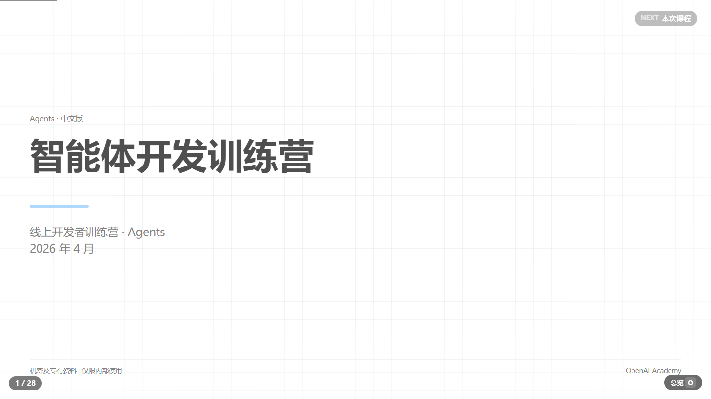

# pptx

从材料创建 16:9 演示文稿：以逐页 HTML 为源码，导出原生可编辑文字的 PowerPoint 和离线 HTML。

[在线浏览 Agents 样本](https://fuetsui.github.io/pptx/Agents.html) · [ClawHub](https://clawhub.ai/FueTsui/skills/pptx) · [下载技能包](https://github.com/FueTsui/pptx/releases/latest)

[](https://fuetsui.github.io/pptx/Agents.html)

## 样本展示

**Agents · 智能体开发训练营**，共 28 页。支持方向键翻页、`O` 打开总览、`Esc` 关闭总览。

- [在线演示](https://fuetsui.github.io/pptx/Agents.html)
- [原始 HTML 文件](skills/pptx/references/Agents.html)
- 可下载 HTML 后离线打开。28 页统一添加“机密及专有资料 · 仅限内部使用”，样本中的 OpenAI Academy 等来源标记予以保留；本项目不表示与其存在官方关系。
- 样本展示 HTML 成果，不包含这份样本的逐页源码项目或 PPTX 文件。

## 能力

- 逐页 HTML 创作、共享主题与 24 类页面 starter。
- 中文字体、语义文字层级和真实视觉行的原生 PPTX 文本导出。
- 保留复杂 CSS 图形的视觉效果；这部分可栅格化，不承诺所有图形均可编辑。
- 连续执行创作、预览、构建和导出；普通生成无需 PowerPoint。
- 提供包清单、可编辑性元数据和独立的技能维护审计入口。

## 安装

ClawHub：

```sh
clawhub install @FueTsui/pptx
```

Codex：下载 Release 中的 `pptx-1.0.1.zip`，将其中的 `pptx` 文件夹放入 `~/.codex/skills/`。也可以从本仓库复制 `skills/pptx`。

技能需要 Python 3.10+、Chrome/Chromium（或支持的 Edge）和 `python-pptx`：

```sh
python -m pip install python-pptx
```

若浏览器无法自动发现，设置 `CHROME_BIN` 为浏览器可执行文件的绝对路径。实际渲染维护审计还需 Windows PowerPoint；普通生成不依赖它。

## 使用

在支持 Agent Skills 的助手中使用 `$pptx` 并提供主题和材料，例如：

> 使用 $pptx，根据这些材料创建中文 16:9 演示稿，交付可编辑 PPTX、离线 HTML 和源码。

Windows（在技能目录执行）：

```powershell
.\scripts\pptx.cmd doctor
.\scripts\pptx.cmd init C:\Presentations\demo
.\scripts\pptx.cmd status C:\Presentations\demo --json
```

macOS / Linux（在技能目录执行）：

```sh
sh scripts/pptx doctor
sh scripts/pptx init ./demo
sh scripts/pptx status ./demo --json
```

按 `status` 返回的动作逐页创作，材料与页面完成后运行 `build <项目>`。完整流程见 [SKILL.md](skills/pptx/SKILL.md)。

## 交付与维护

交付包含 `演示文稿.pptx`、`演示文稿.html`、`pptx-editability.json` 和真实 HTML 源码。已有 PPTX 可作为内容或视觉参考，不承诺无损导入。

技能包位于 `skills/pptx`，网站样本位于 `docs`。修改脚本、模板、样式或审计规则时，按技能说明更新包清单并运行 `audit-skill`；普通演示文稿生成不运行维护审计。

Phosphor Icons 的 MIT 许可保留于 [assets/icons/LICENSE](skills/pptx/assets/icons/LICENSE)。
